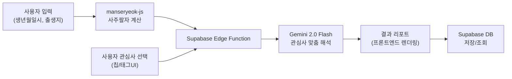

# 사주·운세 웹 플랫폼 — Implementation Plan (v3)

**Active Skills:** `concise-planning` · `ui-ux-pro-max` · `interface-design`

---

## 아키텍처 개요



| 결정 사항 | 선택 |
|-----------|------|
| 만세력 라이브러리 | `@fullstackfamily/manseryeok` |
| AI 해석 | Gemini 2.0 Flash (`gemini-2.0-flash`) |
| 백엔드 | Supabase Edge Function |
| 데이터 저장 | Supabase (PostgreSQL) |
| 차트 | 순수 SVG + React |
| 인증 | Supabase Auth |

---

## 핵심 변경: 사용자 선택형 관심사 해석

> [!IMPORTANT]
> 연령대 고정 해석이 아닌, **사용자가 직접 궁금한 주제를 선택**하는 방식으로 구현합니다.

### 관심사 칩(Chip) UI

사주 입력 후 결과를 요청하기 전, 사용자가 **관심사 태그를 선택**합니다:

```
┌──────────────────────────────────────────────┐
│  궁금한 것을 선택해주세요 (복수 선택 가능)       │
│                                              │
│  [💼 취업·이직] [💕 연애·결혼] [📚 시험·학업]  │
│  [💰 재물·재테크] [🏥 건강] [👶 자녀·육아]     │
│  [🔮 진로·적성] [🤝 대인관계] [🏠 부동산]      │
│  [✈️ 여행·이사] [📈 사업·창업] [🧘 자기계발]   │
│                                              │
│  또는 직접 입력: [________________] 🔍        │
│                                              │
│         [ 🔮 나의 사주 해석 보기 ]              │
└──────────────────────────────────────────────┘
```

### Gemini 프롬프트 구조

```
Prompt = 사주 데이터(팔자/오행/용신) + 선택된 관심사 목록 + 연령 정보(참고용)

→ 관심사에 특화된 맞춤 해석 3~5개 영역
→ 각 영역별 실용 조언 + 행운 팁
→ 자연어 직접 질문 시 자유 해석
```

---

## 레퍼런스 사이트 디자인 분석

### 시각 분석 결과

````carousel

<!-- slide -->

<!-- slide -->

````

### 레퍼런스별 디자인 인사이트

| 레퍼런스 | 채택할 패턴 | 우리 프로젝트 적용 |
|---------|-----------|-----------------|
| **포스텔러** | MZ 친화 캐릭터, 칩/필 UI, SNS형 피드 | 관심사 칩 선택 UI, 친근한 카드 일러스트 |
| **정통사주** | 깊이 있는 카드형 결과, 개인정보 최소화 | 영역별 해석 카드 디자인, 게스트 모드 우선 |
| **척척사주** | 2컬럼 그리드, Free/Pro 분리, 일러스트 | 홈 서비스 카드 레이아웃, 서비스 카테고리 구조 |
| **만세력닷컴** | 중앙집중 미니멀 입력폼, 아코디언 추가옵션 | 사주 입력 Step1 간결 폼, 고급옵션 접기 패턴 |

---

## 디자인 가이드 (기존 xml예시.md 토큰 기반)

> [!NOTE]
> 아래 규격은 이미 프로젝트에 구현된 [index.css](file:///c:/Users/dbcdk/Desktop/%EC%82%AC%EC%A3%BC%EC%82%AC%EC%9D%B4%ED%8A%B8%EC%B0%BD%EC%9E%AC/src/index.css), [tailwind.config.ts](file:///c:/Users/dbcdk/Desktop/%EC%82%AC%EC%A3%BC%EC%82%AC%EC%9D%B4%ED%8A%B8%EC%B0%BD%EC%9E%AC/tailwind.config.ts)의 디자인 토큰을 기준으로 합니다. 레퍼런스 분석 결과를 반영한 **추가 디자인 규칙**입니다.

### 색상 팔레트 (기존 유지 + 보강)

| 용도 | 토큰 | 값 | 레퍼런스 참고 |
|------|------|----|-------------|
| 기본 배경 | `color.bg.base` | `#FFFDF8` | 척척사주 연한 배경 톤 |
| 카드 배경 | `color.bg.elevated` | `#FFFFFF` | 만세력닷컴 화이트 카드 |
| 주요 CTA | `color.accent.lavender` | `#CBB7F6` | 포스텔러 퍼플 강조 |
| 보조 CTA | `color.accent.mint` | `#AEE7D8` | 만세력닷컴 틸 버튼 |
| 관심사 칩 활성 | `color.accent.pink` | `#F3B6C7` | 포스텔러 칩 스타일 |
| 관심사 칩 비활성 | `color.bg.subtle` | `#F6EFE6` | - |

### 레이아웃 규칙 (레퍼런스 반영)

| 규칙 | 값 | 근거 |
|------|----|------|
| 홈 서비스 카드 | 모바일 1col, 태블릿+ 2col 그리드 | 척척사주 2컬럼 카드 그리드 |
| 입력 폼 최대 폭 | 480px 중앙 정렬 | 만세력닷컴 중앙집중 입력 |
| 관심사 칩 | 가로 wrap, min-width 없음, gap 8px | 포스텔러 칩/필 패턴 |
| 결과 리포트 카드 간격 | 16px 동일 | xml예시.md 카드 스택 간격 |
| 결과 카드 일러스트 영역 | 상단 160px, 라운드 24px | 척척사주 카드 이미지 영역 |

### 컴포넌트 규격 (레퍼런스 보강)

| 컴포넌트 | 규격 | 레퍼런스 |
|---------|------|---------|
| **관심사 칩** | h-40px, px-16px, radius-full, font.caption, 이모지+텍스트 | 포스텔러 |
| **서비스 카드** (홈) | 상단 일러스트 160px + 하단 텍스트 120px, radius-24px | 척척사주 |
| **배지** (Free/Pro) | h-24px, px-8px, radius-12px, font.label(11px) | 척척사주 |
| **입력 폼 카드** | max-w-480px, padding 24px, radius-24px, shadow-sm | 만세력닷컴 |
| **듀얼 CTA** | 2개 버튼 가로 배치, gap-12px, 같은 높이 56px | 척척사주 |
| **자유 입력** | Input + 검색 아이콘 suffix, 52px 높이 | 만세력닷컴 |

---

## Proposed Changes

### Phase 1: 사주 엔진 & 데이터 모델 (최우선)

---

#### [NEW] sajuEngine.ts (`src/lib/sajuEngine.ts`)
- `@fullstackfamily/manseryeok`의 `calculateSaju()` 래핑
- 입력: 양력/음력 년/월/일/시/분 + 경도(출생지)
- 출력: 사주팔자(4주 한글+한자), 오행 분포

#### [NEW] ohengCalculator.ts (`src/lib/ohengCalculator.ts`)
- 천간/지지 → 오행 비율(%) 계산
- 부족/과다 오행 판별, 일간 기준 용신 추출

#### [NEW] result.ts (`src/types/result.ts`)
- `SajuResult`: 팔자 4주, 오행 분포, 일간 특성, 용신
- `UserInterest`: 관심사 태그 enum (`career`, `love`, `health`, `money` ...)
- `GeminiAnalysis`: 영역별 해석 + 실용 조언 + 행운 팁
- `FortuneResult`, `CompatibilityResult`

#### [NEW] Supabase 마이그레이션
- `saju_results`: 사주 계산 결과 + Gemini 해석 + 선택 관심사 저장
- `user_profiles`: 사용자 출생 데이터
- `compatibility_results`: 궁합 결과

---

### Phase 2: Gemini 해석 Edge Function

---

#### [NEW] Edge Function: `analyze-saju` (`supabase/functions/analyze-saju/`)
- **입력**: `{ sajuData, interests: string[], freeQuestion?: string }`
- **관심사 기반 프롬프트**: 선택된 관심사에 따라 해석 초점 동적 생성
- **자유 질문 지원**: 직접 입력 시 해당 질문에 맞춤 해석
- Gemini `gemini-2.0-flash` 모델 사용
- 응답 구조: `{ summary, sections[{ title, interpretation, advice, luckyTip }], }`

#### [NEW] Edge Function: `daily-fortune` (`supabase/functions/daily-fortune/`)
- 일간 + 당일 천간/지지 조합 → 오늘/주간/월간 운세

#### [NEW] geminiClient.ts (`src/lib/geminiClient.ts`)
- Edge Function 호출 래퍼 + 에러 핸들링

---

### Phase 3: 차트 & 시각화 (순수 SVG)

---

#### [NEW] OhengDonutChart.tsx (`src/components/charts/OhengDonutChart.tsx`)
- SVG 도넛 220px, stroke 20px, 목→화→토→금→수 고정 순서

#### [NEW] DaeunTimeline.tsx (`src/components/charts/DaeunTimeline.tsx`)
- SVG 수평 타임라인 160px, 현재 대운 노드 강조

#### [NEW] LuckScoreRing.tsx (`src/components/charts/LuckScoreRing.tsx`)
- SVG 원형 프로그레스 144px, 중앙 점수

#### [NEW] MonthlyFortuneGraph.tsx (`src/components/charts/MonthlyFortuneGraph.tsx`)
- SVG 라인 차트 180px, 0~100 고정축

#### [NEW] ChartLegend.tsx (`src/components/charts/ChartLegend.tsx`)
- 색상+텍스트+수치 3종 병행

---

### Phase 4: 핵심 페이지 구현 (4개 + 홈 개선)

---

#### [MODIFY] Index.tsx — 홈 리디자인
- 척척사주 참고 2컬럼 서비스 카드 그리드 (일러스트 + 설명)
- 서비스별 배지(Free/Pro) 시각 구분

#### [NEW] InterestSelector.tsx (`src/components/saju/InterestSelector.tsx`)
- 관심사 칩(Chip) 복수 선택 UI + 자유 입력 필드
- 이모지 + 텍스트, 선택 시 accent-pink 하이라이트

#### [MODIFY] SajuInput.tsx — 입력 UX 전면 리디자인 ⭐
- **기존**: 휠 드로어(WheelDrawer) 방식 → **변경**: 그리드 버튼 선택 방식 ([saju-report-automation](https://saju-report-automation.vercel.app/saju) 참고)
- **단계 확장**: 기존 3단계 → 새 단계 구성:
  - Step 1: 달력 유형 (양력/음력 카드 선택)
  - Step 2: 출생년도 (연대 → 연도 그리드 버튼)
  - Step 3: 출생월 (3×4 그리드)
  - Step 4: 출생일 (7×5 그리드)
  - Step 5: 출생시간 (하이브리드: 정확한 시간 입력 + 대략적 시간대 칩 그리드)
  - Step 6: 출생지 (도시 그리드 버튼)
  - Step 7: 성별 (대형 카드 2열)
  - Step 8: **관심사 선택** (칩 복수 선택 + 자유 입력)
  - Step 9: 입력 확인 (요약 카드 + 항목별 "수정" 링크)
- 프로그레스 바: "Step X of 9" + 퍼센트 표시
- 디자인 참고: [상세 분석 보고서](file:///C:/Users/dbcdk/.gemini/antigravity/brain/38881167-d45a-4748-a3bb-51cf4b937cdb/reference_design_analysis.md)

#### [NEW] ResultPage.tsx (`src/pages/ResultPage.tsx`)
- 핵심 기운 카드 → 오행 차트 → 대운 타임라인 → **관심사별 맞춤 해석 카드** → 실용 조언 → 저장·공유 CTA

#### [NEW] FortunePage.tsx (`src/pages/FortunePage.tsx`)
- segmented 탭(오늘/주간/월간) → 점수카드 → 행운 컬러/아이템

#### [NEW] CompatibilityPage.tsx (`src/pages/CompatibilityPage.tsx`)
- 두 사람 입력 → 궁합 점수 링 → 상생·상극 → 관계 조언

#### [NEW] MyPage.tsx (`src/pages/MyPage.tsx`)
- 프로필 → Supabase 저장 리포트 목록 → 궁합 상대 → 설정

#### [MODIFY] App.tsx — 라우트 추가
- `/result`, `/fortune`, `/compatibility`, `/mypage`

---

### Phase 5: 공통 인프라 & 접근성/QA

---

#### [NEW] EmptyState / SkeletonCard / ErrorCard / StickyCTA
- xml예시.md 규격 준수

#### 접근성 (A11y) 적용
- `aria-label`, `focus-visible`, `aria-live`, `lang="ko"`

#### QA 검수
- 375 / 768 / 1024 / 1440px 반응형 검수

---

## 작업 우선순위

| # | 작업 | 규모 |
|---|------|------|
| 1 | manseryeok-js 설치 + 사주 엔진 + 타입 정의 | M |
| 2 | Supabase 테이블 마이그레이션 | S |
| 3 | **관심사 선택 UI (InterestSelector)** | M |
| 4 | Edge Function `analyze-saju` (관심사 기반 프롬프트) | L |
| 5 | Edge Function `daily-fortune` | M |
| 6 | SVG 차트 4종 + 범례 | M |
| 7 | 결과 리포트 페이지 | L |
| 8 | 사주 입력 Step4 (관심사 선택) 추가 | S |
| 9 | 홈 리디자인 (서비스 카드 그리드) | M |
| 10 | 운세 / 궁합 / 마이페이지 | L |
| 11 | 공통 컴포넌트 + A11y + QA | M |

---

## Verification Plan

### 자동 테스트
```bash
npx vitest run          # 유닛 테스트
npx tsc --noEmit        # 타입 체크
npx vite build          # 빌드 검증
```

### 브라우저 검증
1. **핵심 플로우**: 홈 → 사주 입력 → **관심사 선택** → Gemini 해석 → 결과 리포트
2. **관심사 분기**: "연애+재물" 선택 vs "건강+사업" 선택 시 다른 해석 확인
3. **자유 질문**: "이번 달 이직하면 좋을까?" 입력 시 맞춤 답변 확인
4. **반응형**: 375 / 768 / 1024 / 1440px
5. **데이터 저장**: Supabase에 결과 + 관심사 저장 → 마이페이지 조회
